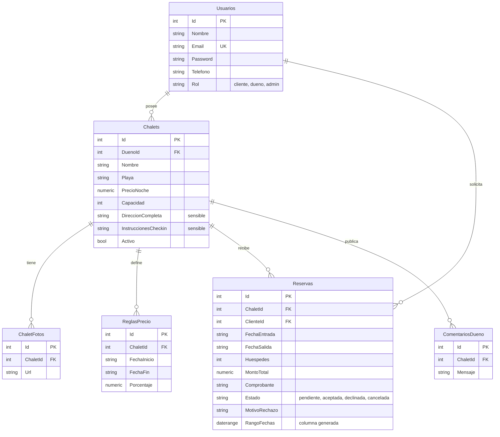

# Arquitectura y modelo de datos

## 1. Estilo arquitectónico

El sistema sigue una arquitectura **cliente-servidor en capas**, con separación estricta entre presentación, lógica de negocio y persistencia. No se emplearon microservicios ni colas de mensajería: para una plataforma con un volumen moderado de chalets y reservas, esas piezas agregarían complejidad operativa sin un beneficio medible.

```
┌──────────────────────────────────────────────────────────┐
│  Presentación                                            │
│  HTML5 · CSS3 · Bootstrap 5 · JavaScript Vanilla         │
│  Listado público · Panel del cliente · Panel del dueño   │
│  Panel de administración                                 │
└────────────────────────┬─────────────────────────────────┘
                         │ HTTPS / JSON (Fetch API)
┌────────────────────────▼─────────────────────────────────┐
│  Rutas (Express Router)                                  │
│  Autenticación JWT por rol · validación de entrada        │
├──────────────────────────────────────────────────────────┤
│  Servicios                                                │
│  Reglas de negocio · cálculo de precio y disponibilidad · │
│  analítica de demanda · generación del reporte PDF        │
├──────────────────────────────────────────────────────────┤
│  Acceso a datos (pg / node-postgres)                      │
│  Consultas parametrizadas, sin ORM                         │
└────────────────────────┬─────────────────────────────────┘
                         │
┌────────────────────────▼─────────────────────────────────┐
│  PostgreSQL — 6 tablas                                    │
└──────────────────────────────────────────────────────────┘
```

### Regla de dependencia

Cada capa conoce solo a la inmediatamente inferior: **ruta → servicio → base de datos**. Una ruta nunca ejecuta una consulta SQL directamente (salvo el listado agregado de administración, que reutiliza el helper `query()` de la capa de datos por ser una lectura simple sin reglas de negocio); toda validación y todo cálculo vive en `services/`. Esto permite razonar sobre las reglas de negocio en un solo lugar y facilita las pruebas manuales endpoint por endpoint.

---

## 2. Patrones aplicados

| Patrón | Dónde | Por qué |
|---|---|---|
| Layered architecture (ruta → servicio → datos) | Todo `backend/src/` | Separa validación HTTP, reglas de negocio y persistencia |
| Middleware de autorización | `middleware/auth.js` (`requiereAuth`, `requiereRol`) | Centraliza la verificación de token y de rol antes de llegar al controlador |
| Guard clause / early return | Todos los servicios (`ErrorApp`) | Cada regla de negocio se valida y corta el flujo antes de tocar la base de datos |
| Repository-like helpers | `db.js` (`query`, `queryUna`) | Aísla el driver `pg` del resto del código sin necesidad de un ORM completo |
| Streaming response | `services/reportePdf.js` | El PDF se genera y transmite directo a la respuesta HTTP, sin guardarlo en disco |
| Constraint-based invariants | Esquema SQL (`CHECK`, `EXCLUDE`) | Las reglas más críticas (montos positivos, doble reserva) se garantizan en la base, no solo en el código |

---

## 3. Modelo de datos

### 3.1 Diagrama entidad-relación



### 3.2 Decisiones de diseño que conviene poder defender

**Un solo modelo de usuario para tres roles.** En lugar de tablas separadas para clientes, propietarios y administradores, existe una tabla `usuarios` con una columna `rol` restringida por `CHECK`. Simplifica la autenticación (un único flujo de login para los tres) y evita duplicar campos como email o teléfono. El registro público solo permite `cliente` o `dueno`; `admin` nunca se expone por esa vía.

**Las fechas de reserva se guardan como TEXT, no como DATE.** El driver de PostgreSQL para Node.js convierte las columnas `DATE` a objetos `Date` de JavaScript en la zona horaria del proceso, lo que puede desplazar la fecha mostrada en un día según el huso horario del servidor donde corra el backend. Guardando el mismo string `'YYYY-MM-DD'` que el cliente envía —y que el backend siempre compara como texto— se elimina esa clase de error por completo, sin sacrificar capacidad de consulta: una columna generada (`rango_fechas`) reconstruye la fecha real únicamente para uso interno del motor de base de datos.

**La doble reserva se impide en el motor, no solo en el código.** Existe una restricción de exclusión:

```sql
ALTER TABLE reservas
  ADD CONSTRAINT ux_reservas_no_solape
  EXCLUDE USING gist (
    chalet_id WITH =,
    rango_fechas WITH &&
  )
  WHERE (estado IN ('pendiente','aceptada'));
```

El servicio `services/chalets.js` (función `estaDisponible`) ya valida disponibilidad antes de insertar, pero esa validación por sí sola deja abierta una ventana de concurrencia: si dos solicitudes llegan casi al mismo tiempo para el mismo chalet, ambas podrían pasar la validación de aplicación antes de que la primera termine de escribirse. La restricción `EXCLUDE` hace que el propio PostgreSQL rechace físicamente la segunda inserción si su rango de fechas se traslapa con una reserva viva del mismo chalet — sin importar que la aplicación lo haya revisado o no. El backend captura ese rechazo (código de error `23P01`) y lo traduce al mismo mensaje que la validación de aplicación, así que el usuario nunca ve un error técnico.

El filtro `WHERE estado IN ('pendiente','aceptada')` es lo que permite que una reserva declinada o cancelada libere el rango de fechas para que otra pueda ocuparlo.

**Los datos sensibles del chalet se ocultan por defecto.** `direccion_completa` e `instrucciones_checkin` viajan en cada consulta a la tabla `chalets`, pero `services/chalets.js` los omite de la respuesta salvo que quien pregunta sea el propio dueño, un administrador, o un cliente cuya reserva para ese chalet esté en estado `aceptada`. Es una decisión de la capa de servicio, no de la base de datos: la tabla no necesita dos copias del dato.

**Aislamiento estricto por propietario.** Cada consulta que lista chalets o reservas "míos" filtra explícitamente por `dueno_id = usuario.id` en el `WHERE` (nunca se confía en que el cliente solo pida sus propios datos). La función `verificarDueno()` se reutiliza en cada operación de escritura (editar, eliminar, agregar fotos, definir reglas de precio, aceptar o declinar reservas) para que un propietario nunca pueda tocar un chalet ajeno, incluso si adivina el `id` en la URL.

**Sin tablas de catálogo para roles ni estados.** A diferencia de otros sistemas donde roles y estados son tablas separadas referenciadas por llave foránea, aquí ambos son restricciones `CHECK` sobre una columna `TEXT`. Es adecuado para un conjunto de valores fijo y pequeño (3 roles, 4 estados) que no necesita atributos adicionales como color o descripción; evita además la necesidad de un script de datos iniciales.

---

## 4. Seguridad

### Contraseñas

Se usa **bcrypt** con 10 rondas de costo (`config.rondasBcrypt`), vía la librería `bcryptjs`. El hash se genera con `bcrypt.hashSync` y se compara con `bcrypt.compareSync`; ambas operaciones son de tiempo aproximadamente constante respecto al contenido de la contraseña, por el propio diseño del algoritmo bcrypt.

### Autenticación y autorización

JWT firmado con HMAC-SHA256 (`jsonwebtoken`), con expiración configurable (24 horas por defecto). El token incluye `id`, `nombre`, `email` y `rol`. Cada ruta protegida usa dos middlewares combinables:

- `requiereAuth`: exige un token válido y adjunta el usuario decodificado a `req.usuario`.
- `requiereRol(...roles)`: exige que el rol del usuario esté en la lista permitida.

| Rol | Alcance |
|---|---|
| Administrador | Acceso total: usuarios, todos los chalets, todas las reservas |
| Dueño (propietario) | Solo sus propios chalets y las reservas de esos chalets |
| Cliente | Solo sus propias reservas |

Un propietario que intente aceptar la reserva de un chalet ajeno recibe 403 (`Este chalet no te pertenece`), validado en `verificarDueno()` antes de cualquier escritura.

### Mensajes de error en el inicio de sesión

Un correo inexistente y una contraseña incorrecta producen exactamente el mismo mensaje: *Credenciales incorrectas*. Diferenciarlos permitiría enumerar qué correos están registrados en el sistema. El mismo criterio aplica al registro: intentar registrar un correo ya existente responde con un mensaje genérico (*No se pudo completar el registro con esos datos*) en lugar de confirmar que ese correo ya está en uso.

### Precio calculado siempre en el servidor

`services/reservas.js` (función `crear`) recalcula el monto total a partir del precio del chalet y las reglas de precio vigentes, sin aceptar ningún total enviado por el cliente en el cuerpo de la petición. Evita que una reserva manipulada desde el navegador se cree con un precio distinto al real.

---

## 5. Flujo de una reserva

Es el flujo central de la plataforma y merece describirse paso a paso:

1. El cliente busca chalets por fecha, playa o número de huéspedes (`GET /api/chalets`, que filtra por disponibilidad real, no por un campo de estado precalculado).
2. Solicita la reserva (`POST /api/reservas`). El servidor valida fechas, capacidad y disponibilidad, calcula el monto con las reglas de precio vigentes, e inserta la reserva en estado `pendiente`.
3. El cliente sube el comprobante de la transferencia (`POST /api/reservas/:id/comprobante`), solo permitido mientras la reserva sigue `pendiente`.
4. El propietario revisa la solicitud desde su panel y decide: **aceptar** (`PUT /api/reservas/:id/aceptar`) o **declinar** con un motivo obligatorio (`PUT /api/reservas/:id/declinar`).
5. Al aceptar, la dirección completa y las instrucciones de check-in del chalet quedan visibles para ese cliente en esa reserva específica — antes de aceptar, esos campos viajan como `null`.
6. El cliente puede cancelar en cualquier momento mientras la reserva no esté ya `declinada` o `cancelada` (`PUT /api/reservas/:id/cancelar`), lo que libera automáticamente el rango de fechas para otras solicitudes.

No existe una tabla de "fechas disponibles": la disponibilidad se calcula en el momento (`estaDisponible()`), recorriendo las reservas vigentes del chalet y verificando solapamiento de rangos. La ventaja es la misma que documenta la restricción `EXCLUDE`: al cancelar o declinar una reserva, el horario vuelve a estar libre de forma automática, sin ninguna lógica adicional que pueda quedar desincronizada.

---

## 6. Analítica de demanda

`services/analitica.js` agrega las reservas vigentes (`pendiente` o `aceptada`) por mes, por día de la semana y por chalet, y cruza cada noche reservada contra un calendario fijo de feriados nacionales de Guatemala. La proyección de demanda es una **heurística** —promedio histórico de noches por mes con un suavizado hacia ese promedio general—, explícitamente no un modelo de aprendizaje automático: con el volumen de datos de un prototipo, un modelo más complejo no aportaría precisión real y sería más difícil de explicar y defender.

La Semana Santa, por ser una fecha móvil cada año, no se detecta automáticamente en el conteo de feriados; queda anotado en la respuesta de la API (`nota_semana_santa`) para que el panel se lo indique al usuario en lugar de omitirlo en silencio.

---

## 7. Reporte descargable en PDF

`services/reportePdf.js` genera, con la librería `pdfkit`, un documento con encabezado de marca, tarjetas de resumen (reservas totales, confirmadas, pendientes, ingresos confirmados y potenciales) y una tabla detallada por reserva. Se transmite directamente como flujo (`doc.pipe(res)`) hacia la respuesta HTTP con encabezado `Content-Disposition: attachment`, sin escribir ningún archivo temporal en disco — relevante para un despliegue en un servicio con almacenamiento efímero.
